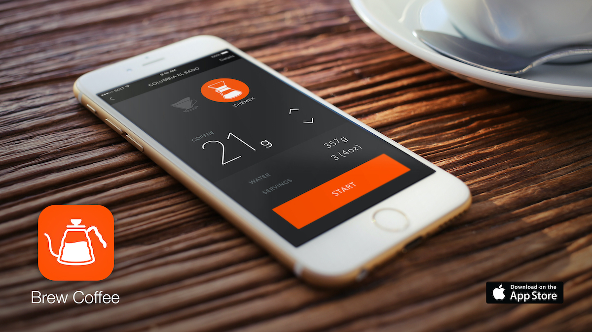
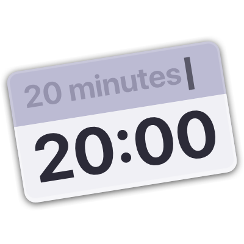
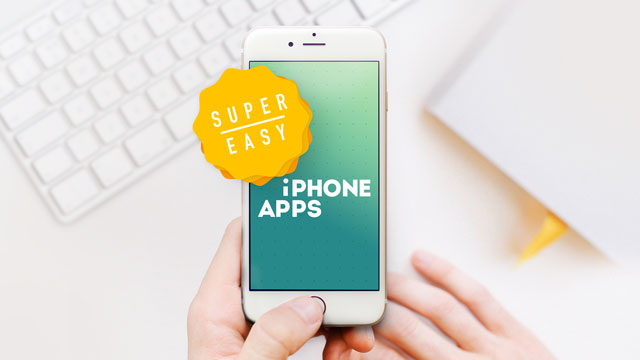
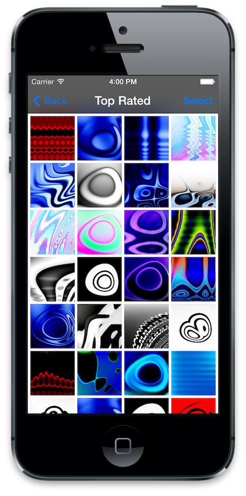
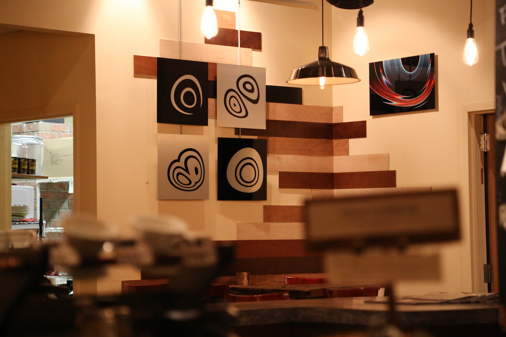

# Paul Solt - Portfolio

I am an iOS developer, writer, speaker, and product designer.

I am looking for a new Staff/Senior iOS Developer role where I can improve the customer experience. I enjoy collaborating with Product and Design teams to create new iOS apps and enhance existing experiences. Since 2011, I have published six iOS/macOS apps on the App Store, and I have a popular iOS Development YouTube channel. I am comfortable speaking and presenting to senior leadership and giving technical talks to engineers.

My experience spans tech companies like GoPro, Lambda School, Apple, and Microsoft, as well as iOS/Mac software contracts.

* I understand usability and accessibility. I can make your apps more straightforward and less frustrating to use.
* I break software – I can find and fix bugs you didn't know you had.
* I am incredibly proficient with UIKit, SwiftUI, and Auto Layout — I can implement any design.
* I can quickly mockup, design, and implement new functionality to meet business goals.
* I can translate technical jargon into everyday language for non-technical people.
* I can teach any technical topic and mentor your junior developers.

## Contact

* Email: [PaulSolt@gmail.com](mailto:PaulSolt@gmail.com)
* [Recommendations](Recommendations.md)

## Open Source Contributions

* [Embedded Swift (Apple)](https://github.com/apple/swift-matter-examples/pull/24)
* [Embedded Swift Install Instructions](https://github.com/apple/swift-matter-examples/pull/25)

## Speaking

* [try! Swift New York 2019: Super Easy Combine Workshop](https://www.tryswift.co/events/2019/nyc/#combinewrkshp) (30-40 people)

## Companies

### GoPro (Staff Software Engineer - iOS)

**GoPro Accomplishments**

* Led a hackathon team of 8 people (Designer, Developers, QA, and Product) to win the 2023 Hackathon for improving the Frame Grab experience (GoPro’s most popular editing tool) by streamlining the user experience.
* [2.8+ million users]: Led a hackathon team of 5 people to enable iPad Landscape support that shipped in July 2023 (The CEO is an iPad user with a keyboard).
* [Up to 1.15 million users]: Found and fixed a Bluetooth bug that prevented cameras from pairing due to incorrect Privacy and Bluetooth state logic.
* Led a team of 3 people to improve the onboarding experience using a Privacy permissions checklist for Bluetooth, Local Network, and Photo permissions. The hackathon project encouraged Product to update onboarding and shipped in 2022.
* Collaborated with Product and Design on new features.
* Rebuilt the GoPro Quik camera connection screens using SwiftUI for a Bluetooth-first connected experience.

**GoPro Highlights**

* Provided customer support via forums and emailed customers to help fix bugs that were hard to reproduce.
* Monitored App Store reviews for problems not captured by analytics.
* Presented technical topics on UI Testing, camera logging, and git rebase workflows.
* Built a multi-line log filter macOS tool to improve app log readability so that we could track down connectivity problems.
* Wrote the “iOS/macOS Onboarding” guide, “iOS Best Practices” guide, “How to Override LaunchDarkly Flags,” “Connectivity Stress Testing Procedures,” and updated “How to use the Camera Debug Board.”
* Interviewed and helped onboard new hires with regular 1:1 check-ins.
* Improved Wi-Fi and Bluetooth connectivity from Hero4 to Hero12 cameras.
* Documented numerous bugs across GoPro cameras, website, and apps with detailed steps, screenshots, videos, and app logs.

## Apps

### Brew Coffee

Brew Coffee is a pour-over coffee recipe iOS app for Hario V60 and Chemex. It helps automate the manual process of brewing coffee and improves consistency between brews. I hired designers to help create the initial design that is easy to use. I use Brew Coffee daily, and you can [download the latest beta for Brew Coffee here](https://testflight.apple.com/join/yo3qrfji). It uses Swift with a mix of Storyboard and programmatic layouts.

### Super Easy Timer

[Super Easy Timer](https://itunes.apple.com/us/app/super-easy-timer/id1353137878?ls=1&mt=12) is a productivity Mac app that uses natural language processing to turn "20 minutes" into an active countdown timer. It is quick to start and reset so that users can focus on their tasks. I created the visual design and managed the development with two autistic software interns.

## Writing

### Super Easy Apps

I have published numerous iPhone app development articles on the [Super Easy Apps blog](http://blog.SuperEasyApps.com). Including a 7,646 word article on [30 Auto Layout Best Practices](https://blog.supereasyapps.com/30-auto-layout-best-practices/).

### InfoWorld

I have written four 2,000-word articles for InfoWorld on Swift related topics.

* [10 Swift and iOS development masters to learn from](https://www.infoworld.com/article/3320617/swift/10-swift-and-ios-development-masters-to-learn-from.html)
* [Learn Swift: A guide for experienced developers](https://www.infoworld.com/article/3284445/ios/learn-swift-a-guide-for-experienced-developers.html)
* [Learn Swift: 15 beginner-friendly resources for iOS app development](https://www.infoworld.com/article/3275949/ios/learn-swift-15-beginner-friendly-resources-for-ios-app-development.html)
* [Seven Swift 2 enhancements every iOS developer will love](https://www.infoworld.com/article/3027100/mobile-development/seven-swift-2-enhancements-every-ios-developer-will-love.html)

## Teaching

### Lambda School (February 2019 - June 2020)

I was one of the [iOS Instructors at Lambda School](https://lambdaschool.com), where I taught iOS to complete beginners in an immersive 9am-5pm boot camp. Many of my students are now working for companies like MailChimp, Nike, and more. In addition to teaching, I designed new lessons, iterated on teaching content, and supported students until they became hired.

* Sample lectures on iOS and design topics:
    * [Networking with Objective-C](https://www.youtube.com/watch?v=0KEQQ57-lew)
    * [UI Design in Sketch (Part 1/2)](https://www.youtube.com/watch?v=mA8iDAVi9Kw)
    * [Custom UI Design Prototyping in Xcode (Part 2/2)](https://youtu.be/p8yHke6_y6w)
* Sample iOS projects:
    * [Astronomy of the Day iOS App](https://github.com/PaulSolt/ios-module-project-apod)
    * [Today's Weather](https://github.com/PaulSolt/ios-module-project-networking-in-objective-c)

### RIT

At RIT, I taught iPhone app courses as an Adjunct Professor in the [Interactive Games and Media Department](https://www.rit.edu/computing/school-interactive-games-and-media) and the [Computer Science Department](https://www.rit.edu/computing/department-computer-science).

* Multi-platform Media App Dev Course IGME-340-01 (Spring 2018)
* Mobile Computing 4005-785 (Fall 2012)

### YouTube

I have over 16,502 subscribers on my iPhone app focused [YouTube channel](https://www.youtube.com/user/PaulSolt/featured?view_as=subscriber). I have hosted challenges, taught courses, and created tutorials on common iOS questions.

### iPhone Apps 101

iPhone Apps 101 is a beginner Swift 4 course that teaches how to make a tip calculator app. It covers user input, interface design, and animations. [iPhone Apps 101 is published on YouTube](https://www.youtube.com/watch?v=DcW7AT8R1kQ) (29 videos and 4 hours of content). 

### Super Easy iPhone Apps

Super Easy iPhone Apps is a Swift 2 course series on iPhone app development (iOS 9) that teaches using a project-based approach. It shows how to use gestures, animation, user interface design, Auto Layout, Table View, REST APIs, Core Data, Github, Collection Views, and Firebase. There are 212 videos and 30 hours of content. 

Super Easy iPhone Apps was my 3rd successful [Kickstarter project](https://www.kickstarter.com/projects/paulsolt/super-easy-iphone-apps-how-to-make-your-first-ios9). 

## Additional Apps

### Bomb Dodge

[Bomb Dodge](https://itunes.apple.com/us/app/protect-the-bomb/id660318608?mt=8) is a multitouch avoidance game where you need to prevent a bomb from exploding. It uses Cocos2D and Objective-C. I designed and led the project with an artist, composer, and junior developer.

Watch the [gameplay video](https://www.youtube.com/watch?v=MUhljrADpy8) with animations and sound effects on iPad.

### Photo Table

[Photo Table](https://apps.apple.com/us/app/photo-table/id455322208) is a multi-touch interactive slideshow.

Play with your photos on a virtual photo table. Tap, zoom, flick, rotate, and drag images around the table and share your experiences with family and friends. 

### Artwork Evolution

Artwork Evolution is a genetic wallpaper creator that uses mathematics and evolution to create abstract artwork. It uses Objective-C, Objective-C++, C++, and frame-based layout.

The artwork that I created using the app was featured in art festivals (Corn Hill Art Festival, Rochester ARTWalk, Imagine RIT) and coffee shops (Joe Bean Coffee Roasters and Lovin' Cup) around Rochester, NY.

