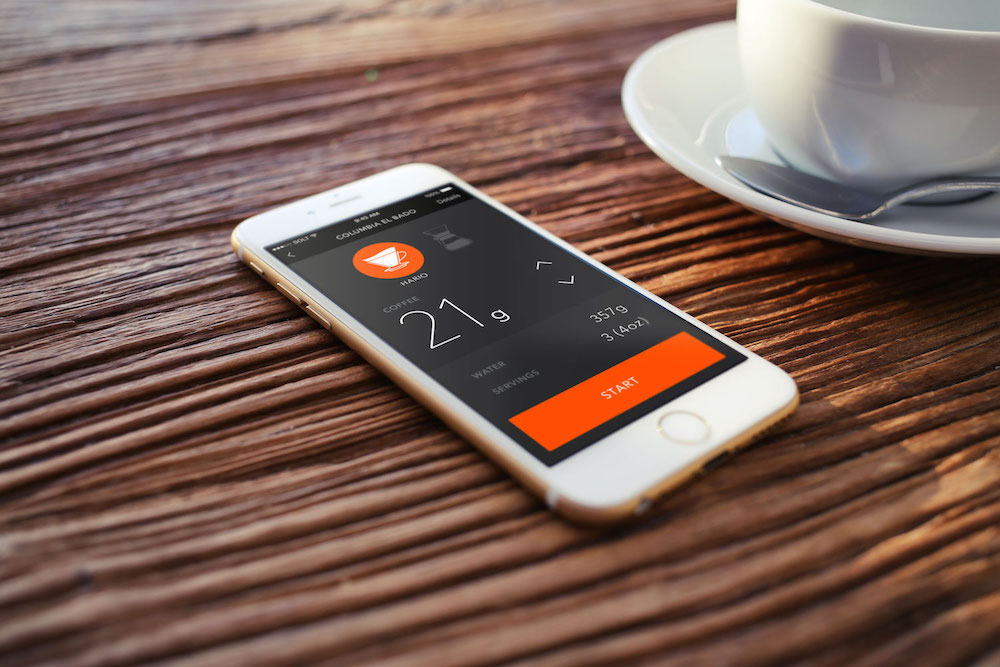
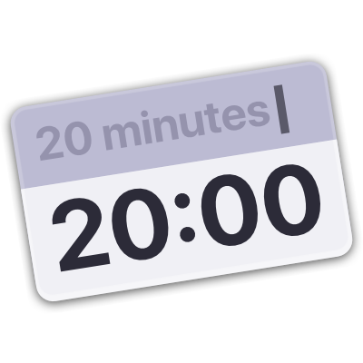
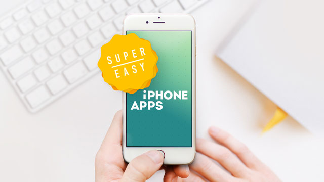
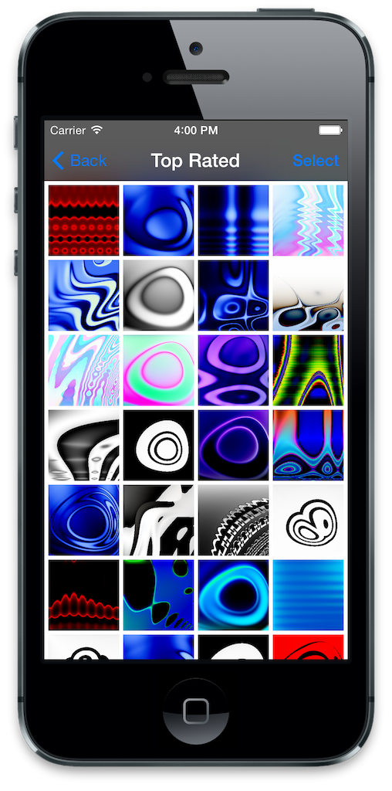
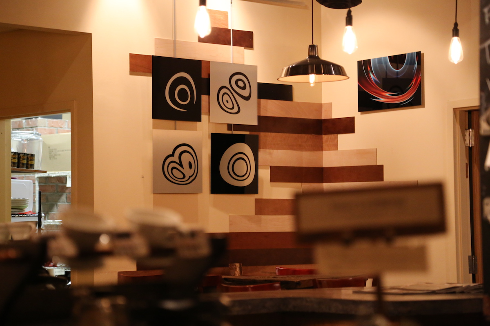

# Paul Solt - Portfolio

I am a developer, writer, speaker, teacher, designer, artist, and product person.

* I previously worked for Apple, Microsoft, Lambda School, and have completed numerous iOS/Mac software contracts.
* I understand usability and accessibility. I can make your apps easier and less frustrating to use.
* I break software—I can find and fix bugs you didn't know you had.
* I am incredibly proficient with UIKit, SwiftUI, and Auto Layout—I can implement any design wireframe programmatically or using Storyboards.
* I can quickly mockup, design, and implement new functionality to meet business goals.
* I can translate technical jargon into everyday language for non-technical people.
* I can teach any technical topic and mentor your junior developers.

## Contact

* Email: [PaulSolt@gmail.com](mailto:PaulSolt@gmail.com)

## Speaking

* [try! Swift New York 2019: Super Easy Combine Workshop](https://www.tryswift.co/events/2019/nyc/#combinewrkshp) (30-40 people)

## Apps

### Brew Coffee

Brew Coffee is a pour-over coffee recipe iOS app for Hario V60 and Chemex. It helps automate the manual process of brewing coffee and improves consistency between brews. I hired designers to help create the initial design that is easy to use. I use Brew Coffee daily, and you can [download the latest beta for Brew Coffee here](https://testflight.apple.com/join/yo3qrfji). It is written in Swift with a mix of Storyboard and programmatic layouts.

### Super Easy Timer

[Super Easy Timer](https://itunes.apple.com/us/app/super-easy-timer/id1353137878?ls=1&mt=12) is a productivity Mac app that uses natural language processing to turn "20 minutes" into an active countdown timer. It is quick to start and reset so that users can focus on their tasks. I created the visual design, and managed the development with two autistic software interns.

## Writing

### Super Easy Apps

I have published numerous iPhone app development articles on the [Super Easy Apps blog](http://blog.SuperEasyApps.com). Including a 7,646 word article on [30 Auto Layout Best Practices](https://blog.supereasyapps.com/30-auto-layout-best-practices/).

### InfoWorld

I have written four 2,000-word articles for InfoWorld on Swift related topics.

* [10 Swift and iOS development masters to learn from](https://www.infoworld.com/article/3320617/swift/10-swift-and-ios-development-masters-to-learn-from.html)
* [Learn Swift: A guide for experienced developers](https://www.infoworld.com/article/3284445/ios/learn-swift-a-guide-for-experienced-developers.html)
* [Learn Swift: 15 beginner-friendly resources for iOS app development](https://www.infoworld.com/article/3275949/ios/learn-swift-15-beginner-friendly-resources-for-ios-app-development.html)
* [Seven Swift 2 enhancements every iOS developer will love](https://www.infoworld.com/article/3027100/mobile-development/seven-swift-2-enhancements-every-ios-developer-will-love.html)

## Teaching

### Lambda School (February 2019 - June 2020)

I was one of the [iOS Instructors at Lambda School](https://lambdaschool.com), where I taught iOS to complete beginners in an immersive 9am-5pm boot camp. Many of my students are now working for companies like MailChimp, Nike, and more. In addition to teaching, I designed new lessons, iterated on teaching content, and supported students until they became hired.

Here is an [iOS homework project]() that I created for students.

### RIT

At RIT, I taught iPhone app courses as an Adjunct Professor in the [Interactive Games and Media Department](https://www.rit.edu/computing/school-interactive-games-and-media) and the [Computer Science Department](https://www.rit.edu/computing/department-computer-science).

* Multi-platform Media App Dev Course IGME-340-01 (Spring 2018)
* Mobile Computing 4005-785 (Fall 2012)

### YouTube

I have over 16,502 subscribers on my iPhone app focused [YouTube channel](https://www.youtube.com/user/PaulSolt/featured?view_as=subscriber). I have hosted challenges, taught courses, and created tutorials on common iOS questions.

### iPhone Apps 101

iPhone Apps 101 is a beginner Swift 4 course that teaches how to make a tip calculator app. It covers user input, interface design, and animations. [iPhone Apps 101 is published on YouTube](https://www.youtube.com/watch?v=DcW7AT8R1kQ) (29 videos and 4 hours of content). 

### Super Easy iPhone Apps

Super Easy iPhone Apps is a Swift 2 course series on iPhone app development (iOS 9) that teaches using a project-based approach. It shows how to use gestures, animation, user interface design, Auto Layout, Table View, REST APIs, Core Data, Github, Collection Views, and Firebase. There are 212 videos and 30 hours of content. 

Super Easy iPhone Apps was my 3rd successful [Kickstarter project](https://www.kickstarter.com/projects/paulsolt/super-easy-iphone-apps-how-to-make-your-first-ios9). 

## Additional Apps

### Bomb Dodge

[Bomb Dodge](https://itunes.apple.com/us/app/protect-the-bomb/id660318608?mt=8) is a multitouch avoidance game where you need to prevent a bomb from exploding. It uses Cocos2D and Objective-C. I designed and led the project with an artist, composer, and junior developer.

Watch the [gameplay video](https://www.youtube.com/watch?v=MUhljrADpy8) with animations and sound effects on iPad.

### Artwork Evolution

Artwork Evolution is a genetic wallpaper creator that uses mathematics and evolution to create abstract artwork. It uses Objective-C, Objective-C++, C++, and frame-based layout.

The artwork that I created using the app was featured in art festivals (Corn Hill Art Festival, Rochester ARTWalk, Imagine RIT) and coffee shops (Joe Bean Coffee Roasters and Lovin' Cup) around Rochester, NY.

